Déployer le Web service avec un simple Serveur JaxWS
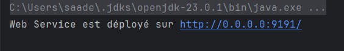

Consulter et analyser le WSDL avec un Browser HTTP
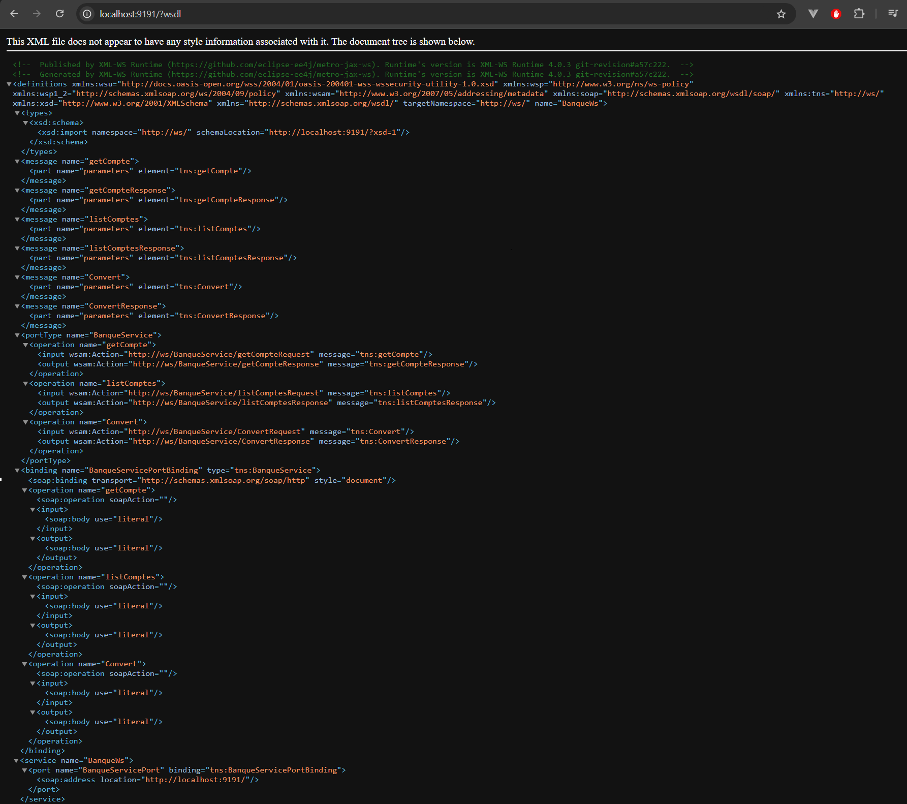

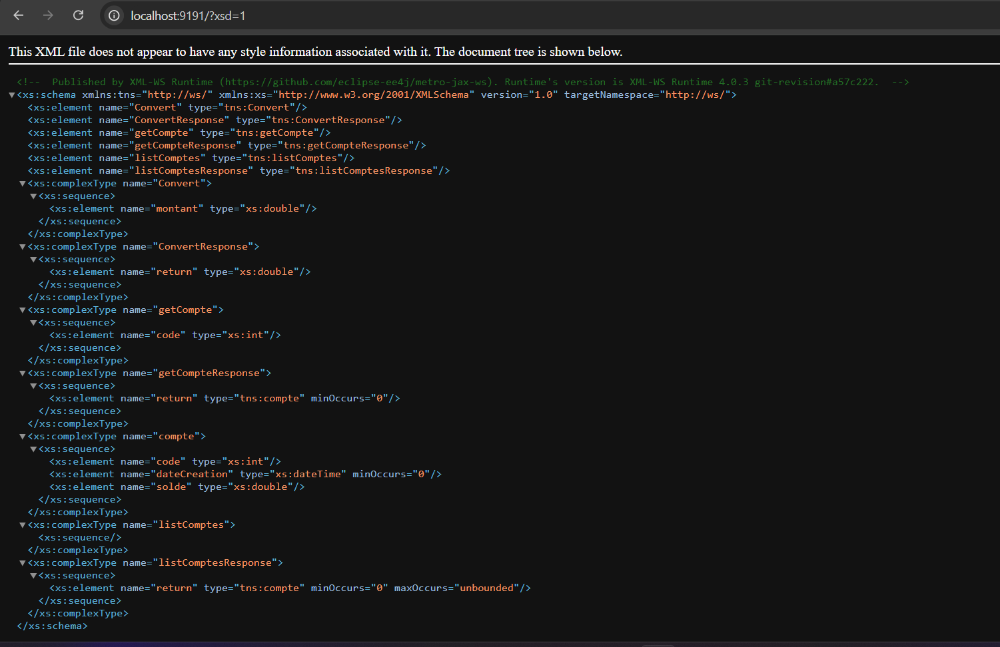

Tester les opérations du web service avec un outil comme SoapUI
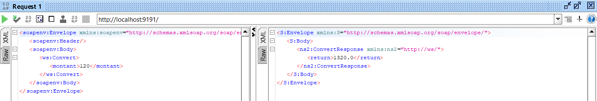

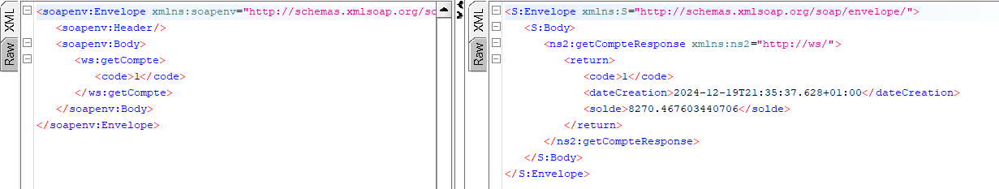

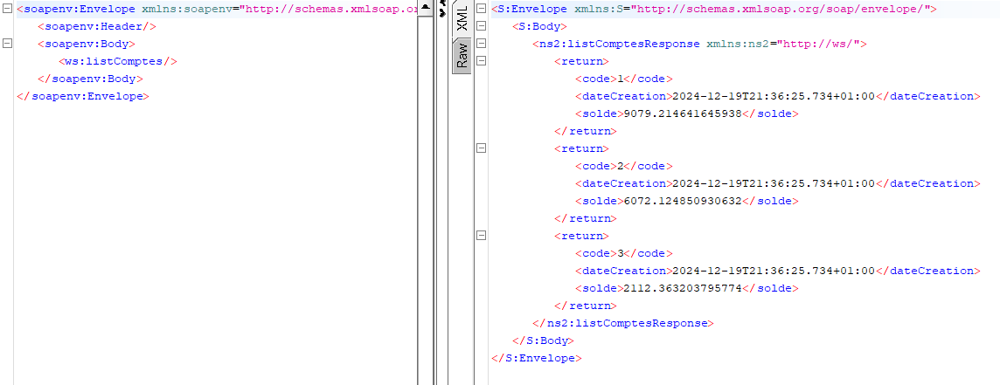

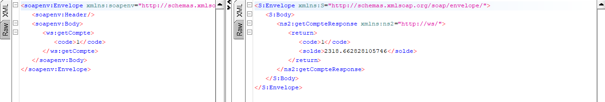

Créer un Client SOAP Java

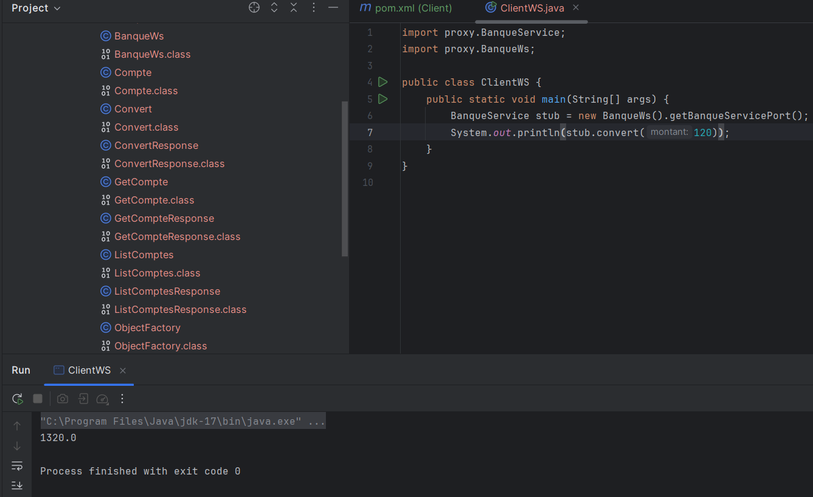

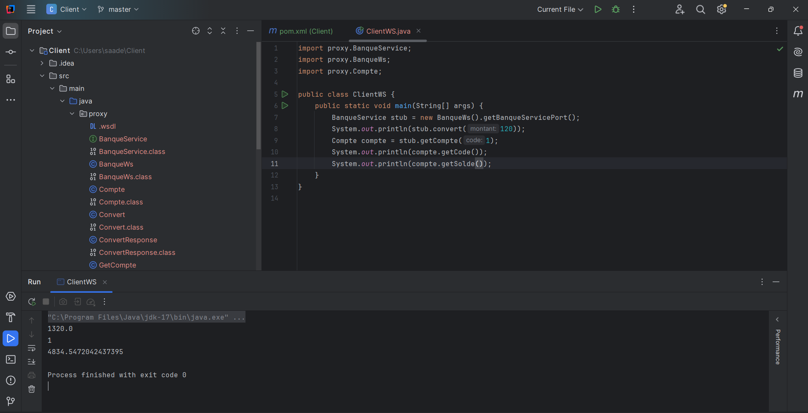

Créer un Client SOAP Dotnet

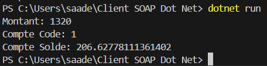

Créer un Client SOAP PHP

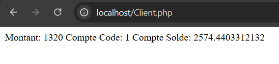
